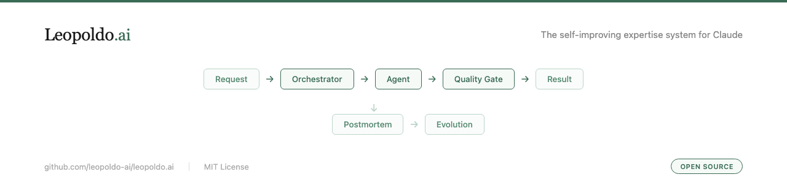

<p align="center">
  
</p>

<p align="center">
  <a href="https://leopoldo.ai"></a>
  <a href="LICENSE"></a>
  <a href="https://github.com/leopoldo-ai/leopoldo.ai/stargazers"></a>
</p>

---

| Other tools | Leopoldo |
|---|---|
| Static prompt files | Self-evolving system |
| No orchestration | Agents route, verify, correct |
| Set and forget | Weekly auto-improvement |
| Failures break silently | Quality gates block bad output |
| You fix mistakes | Postmortem finds root cause |

---

## Quick start

```bash
git clone https://github.com/leopoldo-ai/leopoldo.ai .leo && cp -r .leo/.claude . && rm -rf .leo
```

Open Claude Code. The system activates automatically.

---

## How it works

```
Request
  -> Orchestrator (routes to the right agent)
  -> Specialized agent (produces structured output)
  -> Quality gate (verifies completeness and correctness)
  -> Structured result
```

When something goes wrong:

```
Correction detected
  -> Postmortem runs BEFORE fixing
  -> Root cause identified and logged
  -> Fix applied
  -> Finding queued for next evolution cycle
```

No patching over problems. Root cause or nothing.

---

## What's inside

**148 capabilities** across three areas:

| Area | Capabilities | Description |
|------|:------------:|-------------|
| Full Stack | 84 | Architecture, testing, CI/CD, code review, frontend, backend |
| Essentials | 38 | Strategy, reports, presentations, brand, design foundations |
| Engine | 26 | Orchestration, lifecycle management, Imprint, system hooks |

Plus the full system: orchestrator, workflow agents, quality gates, and lifecycle hooks.

**Engine.** The system core. Orchestrator, quality gates, correction loop, lifecycle manager, and session automation. Runs on every request.

**Imprint.** The adaptive learning layer. Observes corrections, learns preferences, builds a profile. Outputs get more calibrated over time without being told twice.

**system-claw.** Environment scanning on every session start. Detects your MCP servers, CLI tools, and hooks. The system adapts to what you actually have installed. No manual configuration.

**Agents.** 22 specialized workflow agents handle multi-step processes. The open-source platform includes reporting-output (professional documents: docx, pptx, xlsx) and the evolution agent (weekly auto-improvement). Premium domains add domain-specific agents: 6 for finance, 4 for legal, 3 for consulting, 3 for competitive intelligence.

**Full Stack.** Included with every install. Architecture design, testing strategy, CI/CD pipelines, security review, frontend patterns, and code review workflows.

---

## See it work

Prompt:

> "Design the architecture for a multi-tenant SaaS with Stripe billing"

What happens:

1. Orchestrator classifies the request, routes to the right agent
2. Agent produces: system diagram, tech stack recommendation, database schema, API design, Stripe billing integration plan
3. Quality gate verifies completeness against the architecture checklist
4. Structured result delivered in about 45 seconds

No prompt engineering. No retries. The system handles the routing and verification.

---

## The evolution loop

Every correction you make feeds the system.

When you tell Leopoldo an output was wrong, it does not just fix it. It runs a postmortem first: what was the root cause, which capability was responsible, what rule was missing. The fix is applied, the finding is logged.

Once a week, the evolution agent reviews all postmortems, scans the Claude and ecosystem release feeds, and produces a set of proposed patches. You review. You approve. The patches ship.

The system that handles your work today is not the system you will have in 30 days. It compounds.

---

## Architecture

```
skills/
  engine/             System skills (orchestration, lifecycle, Imprint)
  packs/
    common/           Essentials and design foundations (included in every domain)
    dev/              Full Stack development expertise
agents/               Workflow agents (orchestrator, system, reporting, environment)
.claude/              Configuration (settings, symlinks, commands)
.leopoldo/hooks/      Lifecycle hooks (session, logging, validation, gates)
```

---

## Premium domains

| Domain | What you can do | Agents included |
|---|---|---|
| Finance | Due diligence, deal execution, fund management, advisory, trading | 6 specialized agents |
| Legal | Contract lifecycle, corporate counsel, dispute resolution, legal ops | 4 specialized agents |
| Consulting | Engagement management, market sizing, workshops, marketing, medical research | 3 specialized agents |
| Competitive Intelligence | Market positioning, competitor profiling, people intelligence, market monitoring | 3 specialized agents |

Available on request. Visit [leopoldo.ai](https://leopoldo.ai) or contact [hello@leopoldo.ai](mailto:hello@leopoldo.ai)

---

## Services

| Tier | For | What you get |
|------|-----|-------------|
| **Personal** | Professionals who want Claude to work harder | Premium domain of your choice. Full system deployment, dedicated support |
| **Team** | Teams who need AI expertise across their workflow | Premium domains, workflow calibration, team training session. Dedicated support |
| **Enterprise** | Organizations that need full deployment with SLA | Premium and custom based domains, team training session. Dedicated support |

[leopoldo.ai/services](https://leopoldo.ai/services) or contact [hello@leopoldo.ai](mailto:hello@leopoldo.ai)

---

## License

MIT. See [LICENSE](LICENSE).
